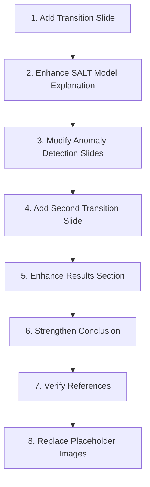

# JAX-bandflux Presentation Implementation Guide

## Introduction

This guide provides a step-by-step approach to implementing all the recommended improvements to your "Bayesian Anomaly Detection for 1a supernovae using JAX-bandflux" presentation. Following this structured approach will ensure a coherent narrative flow while maintaining the technical depth of your presentation.

## Implementation Roadmap

## Detailed Implementation Steps

### 1. Add Transition Slide Between JAX-bandflux and Anomaly Detection

**Location**: After slide 188 (Key Implementation Details)

**Purpose**: Connect JAX-bandflux capabilities to the Bayesian anomaly detection framework

**Content**: See `transition_slide_explanation.md` for detailed content and explanation

**Key Points**:
- Shows how SALT parameters relate to anomaly detection
- Highlights benefits of the combined approach
- Explains how JAX enables efficient implementation

### 2. Enhance SALT Model Explanation

**Location**: Slide 136 (SALT Model in JAX-bandflux)

**Purpose**: Prepare the audience for the connection to anomaly detection

**Content**: See `jax_bandflux_presentation_improvements.md` (Enhanced SALT Model Explanation section)

**Key Points**:
- Add challenge of anomalous measurements
- Introduce Bayesian anomaly detection as a solution
- Maintain all existing technical content

### 3. Modify Anomaly Detection Slides

**Location**: Slide 343 (What is anomaly detection useful for?)

**Purpose**: Include supernovae-specific examples

**Content**: See `jax_bandflux_presentation_improvements.md` (Enhance "What is anomaly detection useful for?" Slide section)

**Key Points**:
- Add supernovae-specific examples for contamination
- Add supernovae-specific examples for anomalies
- Maintain the existing structure

### 4. Add Second Transition Slide Before Results Section

**Location**: Before slide 571 (Results on 1a supernovae)

**Purpose**: Bridge from theory to application

**Content**: See `jax_bandflux_presentation_improvements.md` (Add a Transition from Anomaly Detection to Results section)

**Key Points**:
- Highlight challenges specific to supernovae data
- Compare traditional approaches with your approach
- Emphasize the combined power of JAX-bandflux and anomaly detection

### 5. Enhance Results Section

#### 5.1 Enhance "Anomalous measurements in SALT fitting" Slide

**Location**: Slide 617

**Purpose**: Connect SALT parameters to anomaly detection results

**Content**: See `anomalous_measurements_slide_enhancement.md` for detailed content and explanation

**Key Points**:
- Add impact on specific SALT parameters
- Highlight implementation advantages in JAX-bandflux
- Replace placeholder image if applicable

#### 5.2 Add Parameter Estimation Improvement Slide

**Location**: After the enhanced slide 617

**Purpose**: Show quantitative improvements

**Content**: See `jax_bandflux_presentation_improvements.md` (Add a Slide Showing Parameter Estimation Improvement section)

**Key Points**:
- Compare traditional and anomaly-aware fitting
- Include table of parameter uncertainties
- Highlight practical benefits

### 6. Strengthen Conclusion

**Location**: Slide 741

**Purpose**: Tie all concepts together

**Content**: See `conclusion_slide_enhancement.md` for detailed content and explanation

**Key Points**:
- Highlight JAX-bandflux capabilities
- Emphasize benefits for SALT parameter estimation
- Show combined approach advantages
- Mention open-source implementation

### 7. Verify References

**Purpose**: Ensure all citations are correct and complete

**Actions**:
- Add JAX reference to ref.bib
- Add SALT3 reference to ref.bib
- Add SALT3-NIR reference to ref.bib
- Check all citations in the text
- Ensure consistent citation style

### 8. Replace Placeholder Images

**Locations**:
- Slide 65: "[Space for image showing operations on GPU vs CPU]"
- Slide 637: "[IMAGE: Data with anomalies]"
- Slide 659: "[IMAGE: Fitted curves]"
- Slide 686: "[IMAGE: Flagged bandpasses]"
- Slide 714: "[IMAGE: Extra data usage]"

**Recommendations**:
- Use diagrams that clearly illustrate the concepts
- Ensure consistent visual style
- Include captions that explain the key points
- Make sure text in images is readable

## Testing Your Implementation

After implementing each change, compile your presentation and check:

1. **Visual Consistency**: Do all slides maintain a consistent style?
2. **Narrative Flow**: Do the transitions between sections feel natural?
3. **Technical Accuracy**: Are all equations and explanations correct?
4. **Citations**: Are all references properly cited?

## Additional Resources

For detailed explanations of specific improvements, refer to:

- `jax_bandflux_presentation_improvements.md`: Complete list of all recommended changes
- `jax_bandflux_presentation_summary.md`: High-level overview of improvements
- `jax_bandflux_presentation_checklist.md`: Checklist to track implementation progress
- `transition_slide_explanation.md`: Detailed explanation of the key transition slide
- `conclusion_slide_enhancement.md`: Detailed explanation of the enhanced conclusion
- `anomalous_measurements_slide_enhancement.md`: Detailed explanation of the enhanced results slide

## Final Review

After implementing all changes, perform a final review:

1. **Read through the entire presentation** to ensure coherence
2. **Check all equations** for consistent notation
3. **Verify all images** are properly referenced and explained
4. **Ensure all citations** are correctly formatted
5. **Test the presentation** in presentation mode to check timing and flow

By following this implementation guide, you will create a more cohesive presentation that clearly connects JAX-bandflux capabilities to the Bayesian anomaly detection framework and demonstrates their combined power for supernovae analysis.